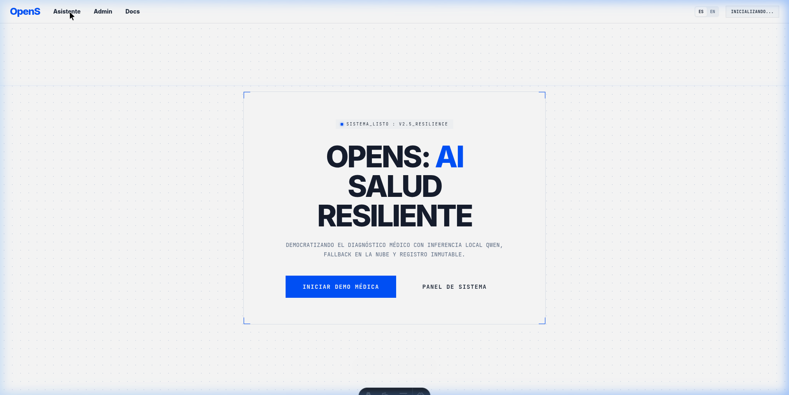
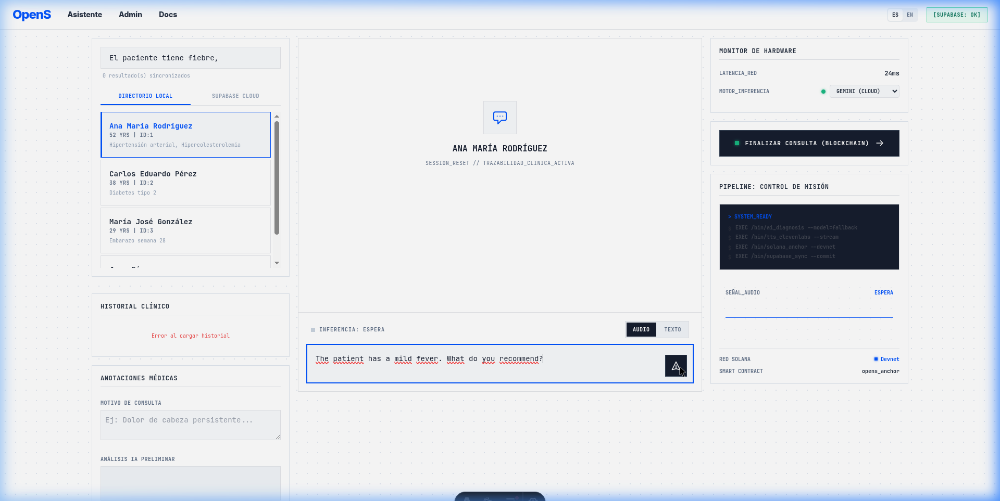
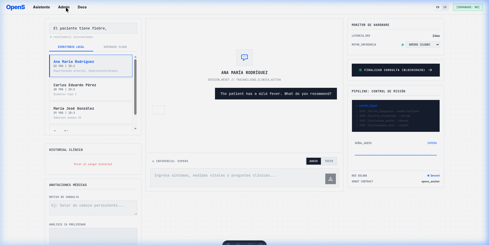
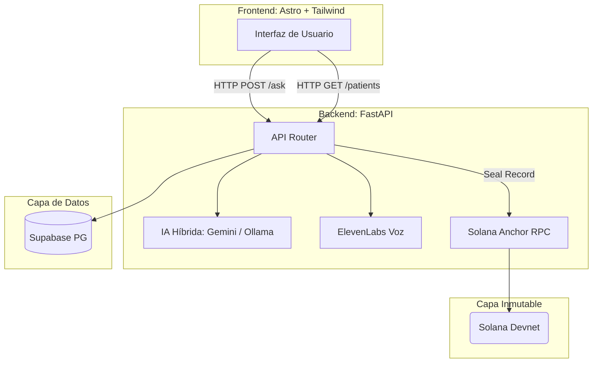

<div align="center">
  
  <h1>OpenS: El CRM Médico Inteligente con Arquitectura Híbrida</h1>
  <p><em>Fortaleciendo la atención primaria de salud con IA, Voice Synthesis y Blockchain.</em></p>

  [](https://astro.build/)
  [](https://python.org/)
  [](https://fastapi.tiangolo.com/)
  [](https://supabase.com/)
  [](https://solana.com/)
  [](https://tailwindcss.com/)
</div>

---

**OpenS** es un ecosistema digital diseñado para fortalecer la atención primaria de salud, especialmente en comunidades vulnerables. Evoluciona de un asistente clínico a un **CRM Médico Integral** que fusiona inteligencia artificial avanzada con un repositorio centralizado de historiales clínicos para empoderar a los profesionales de la salud.

## 🌟 Visión General

El sistema permite a médicos y enfermeros gestionar interacciones, seguimientos y diagnósticos desde una plataforma unificada y humanizada. Su objetivo principal es eliminar la "brecha de olvido institucional" en centros de salud con alta rotación de personal, garantizando que el historial del paciente sea un activo para su recuperación.

### 📸 Vistazos de la Plataforma

| Pantalla de Inicio | Asistente de IA | Dashboard Admin |
| --- | --- | --- |
|  |  |  |

### Beneficios Clave

* **Para el Médico:** Reduce la carga administrativa y proporciona resúmenes precisos para la toma de decisiones.
* **Para el Paciente:** Recibe atención informada y empática, con herramientas de accesibilidad de voz para personas con discapacidades o de la tercera edad.
* **Resiliencia:** Garantiza **Cero Tiempo de Inactividad** mediante una arquitectura que funciona con o sin internet.

---

## 🏗️ Arquitectura del Sistema

OpenS utiliza una arquitectura desacoplada y modular que separa la interfaz de usuario de la lógica de negocio y los servicios de IA.



---

## 🧠 Lógica de IA Híbrida (Fallback)

Para garantizar la disponibilidad en entornos con conectividad inestable (común en zonas rurales o ambulatorios populares), OpenS implementa una transición transparente entre la nube y modelos locales.

**Flujo de decisión:**
1. **Motor Cloud:** Utiliza **Google Gemini 2.5 Flash** para análisis complejos y alta velocidad.
2. **Motor Edge/Local:** Si la API Key no está configurada, expira o hay un error de red, el sistema activa una cadena de modelos locales vía **Ollama**.
3. **Modelos Locales:** Se prueban en secuencia (**Qwen2.5, Kimi-k2**, etc.) hasta que uno responda con éxito.

---

## 🛠️ Stack Tecnológico

| Componente | Tecnología | Descripción |
| --- | --- | --- |
| **Frontend** | Astro 4 & Tailwind CSS | Interfaz rápida y optimizada. |
| **Backend** | FastAPI (Python 3.11) | Centro de inteligencia y procesamiento de datos. |
| **IA Cloud** | Google Gemini 2.5 Flash | Motor principal de generación de lenguaje. |
| **IA Local** | Ollama (Qwen, Llama) | Respaldo para funcionamiento offline. |
| **Base de Datos** | Supabase (PostgreSQL) | Archivo digital seguro de memorias clínicas. |
| **Voz** | ElevenLabs | Accesibilidad mediante síntesis de voz hiperrealista. |
| **Blockchain**| Solana (Anchor) | Sellado inmutable de diagnósticos médicos. |

---

## 🚀 Guía de Ejecución Local (Paso a Paso)

Para probar todas y cada una de las partes del software (Supabase, ElevenLabs, Gemini, Qwen, y Solana), sigue estos pasos cuidadosamente:

### 1. Clonar el repositorio
```bash
git clone https://github.com/CarlosWilliamsR/OpenS-Project.git
cd OpenS
```

### 2. Configurar el Backend
```bash
cd backend-ia
python -m venv .venv
source .venv/bin/activate
pip install -r requirements.txt
```
Configura tu archivo `.env` en la carpeta `backend-ia` usando de guía el archivo existente. Necesitarás:
- `GOOGLE_API_KEY`
- `SUPABASE_URL` y `SUPABASE_KEY`
- `ELEVENLABS_API_KEY`
- `SOLANA_PROGRAM_ID`

Levanta el servidor:
```bash
uvicorn main:app --host 0.0.0.0 --port 8000
```

### 3. Configurar el Frontend
Abre otra terminal:
```bash
cd frontend
npm install
```
Configura tu archivo `.env` en la carpeta `frontend` si tienes variables necesarias. Luego lanza el entorno de desarrollo:
```bash
npm run dev
```

La aplicación estará disponible en `http://localhost:3000`.

---

## ⚠️ Troubleshooting (Solución de Problemas)

¿Qué pasa si la demo no corre correctamente? Aquí te enseñamos cómo solucionarlo al instante:

- **La IA no responde (API Key Expired):** Verifica que la `GOOGLE_API_KEY` sea válida. Si falla, el sistema pasará automáticamente a **Ollama**. Asegúrate de tener Ollama corriendo (`systemctl start ollama`) y el modelo Qwen2.5 descargado (`ollama run qwen2.5:7b`).
- **Error en ElevenLabs (Sin Voz):** Revisa que tu `ELEVENLABS_API_KEY` tenga créditos disponibles y el `ELEVENLABS_VOICE_ID` sea correcto.
- **Error 500 al sellar en Solana:** Revisa que el `SOLANA_PROGRAM_ID` configurado en tu `.env` corresponda exactamente al programa subido en la Devnet. Asegúrate de tener saldo en tu Devnet Wallet (`solana airdrop 2`).
- **Problemas con Supabase:** Confirma que el `SUPABASE_URL` y la `SUPABASE_KEY` del `.env` sean exactamente las que proporciona el panel de settings en tu proyecto de Supabase. Revisa también que la tabla `medical_records` tenga las columnas correctas.

---

## 🔒 Seguridad y Ética

* **Prompt Estricto:** La IA tiene prohibido inventar datos o dar consejos médicos fuera del historial suministrado.
* **Privacidad:** Uso de modelos locales para datos extremadamente sensibles. Sellado criptográfico anonimizado en Blockchain.
* **Gestión de Secretos:** Las claves de API se gestionan mediante variables de entorno local (`.env`).

---

## 👥 Créditos del Proyecto

Este proyecto está en desarrollo para la **Hackathon Solana Colosseum**:

- 💻 **Carlos Williams** - Fundador y Desarrollador Principal.
- 🎨 **Aysha Tovar** - Diseño UX/UI.
- 🤝 **Santiago Valecillos** - Colaborador (Ediciones previas).
- 🤝 **Gabriela Carpio** - Colaboradora (Ediciones previas).
 
