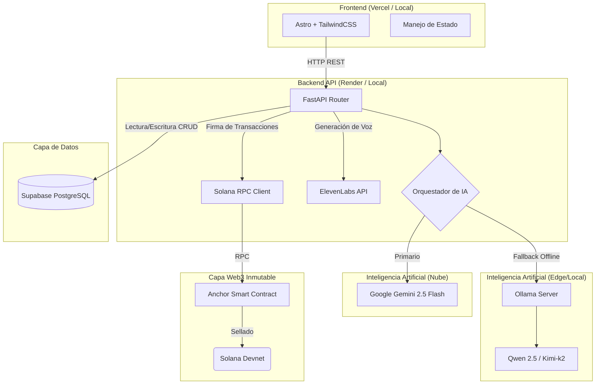

<div align="center">
  <h1>OpenS: El CRM Médico Inteligente Web3</h1>
  <p><em>Construido para la Hackathon Solana Colosseum (Participante destacado en Hackathon 3devpack)</em></p>
  <p><em>Fortaleciendo la atención primaria de salud con IA, Voice Synthesis y Blockchain.</em></p>

  [](https://astro.build/)
  [](https://python.org/)
  [](https://fastapi.tiangolo.com/)
  [](https://supabase.com/)
  [](https://solana.com/)
  [](https://www.rust-lang.org/)
  [](https://tailwindcss.com/)
</div>

---

**OpenS** es un ecosistema digital diseñado para fortalecer la atención primaria de salud, especialmente en comunidades vulnerables. Evoluciona de un asistente clínico a un **CRM Médico Integral Web3** que fusiona inteligencia artificial avanzada con un repositorio centralizado de historiales clínicos para empoderar a los profesionales de la salud. Garantizando inmutabilidad y seguridad mediante la red de Solana.

## 🌟 Visión General

El sistema permite a médicos y enfermeros gestionar interacciones, seguimientos y diagnósticos desde una plataforma unificada y humanizada. Su objetivo principal es eliminar la "brecha de olvido institucional" en centros de salud con alta rotación de personal, garantizando que el historial del paciente sea un activo inmutable para su recuperación.

### 📸 Vistazos de la Plataforma

| Pantalla de Inicio | Asistente de IA | Dashboard Admin |
| --- | --- | --- |
|  |  |  |

### Beneficios Clave

* **Para el Médico:** Reduce la carga administrativa y proporciona resúmenes precisos para la toma de decisiones.
* **Para el Paciente:** Recibe atención informada y empática, con herramientas de accesibilidad de voz para personas con discapacidades o de la tercera edad.
* **Inmutabilidad y Transparencia:** Cada diagnóstico y prescripción se sella en la blockchain de Solana, evitando alteraciones maliciosas.
* **Resiliencia:** Garantiza **Cero Tiempo de Inactividad** mediante una arquitectura de IA Híbrida que funciona con la nube o modelos locales (Edge).

---

## 🏗️ Arquitectura de Infraestructura Detallada

OpenS utiliza una arquitectura web3 desacoplada y modular que separa la interfaz de usuario de la lógica de negocio, los servicios de IA y la capa blockchain.



---

## 🧠 Lógica de IA Híbrida (Fallback System)

Para garantizar la disponibilidad en entornos con conectividad inestable (común en zonas rurales o ambulatorios populares), OpenS implementa una transición transparente entre la nube y modelos locales.

**Flujo de decisión:**
1. **Motor Cloud:** Utiliza **Google Gemini 2.5 Flash** para análisis complejos, razonamiento clínico y alta velocidad.
2. **Motor Edge/Local:** Si la API Key de Google no está configurada, expira o hay un error de red (TimeOut), el sistema intercepta el error y activa una cadena de modelos locales vía **Ollama**.
3. **Modelos Locales:** Se prueban en secuencia (ej. **Qwen2.5**) hasta que se genera una respuesta clínica segura.

---

## 🛠️ Stack Tecnológico

| Componente | Tecnología | Icono | Descripción |
| --- | --- | --- | --- |
| **Frontend** | Astro 4 & Tailwind CSS | 🚀 | Interfaz ultrarrápida, optimizada y accesible. |
| **Backend** | FastAPI (Python 3.11) | ⚡ | Centro de inteligencia asíncrono y procesamiento de datos. |
| **IA Cloud** | Google Gemini 2.5 Flash | 🧠 | Motor principal de generación de lenguaje y razonamiento. |
| **IA Local** | Ollama (Qwen2.5) | 🦙 | Respaldo resiliente para funcionamiento offline. |
| **Base de Datos** | Supabase (PostgreSQL) | 🐘 | Archivo digital seguro de memorias clínicas y autenticación. |
| **Voz (TTS)** | ElevenLabs | 🗣️ | Accesibilidad mediante síntesis de voz hiperrealista. |
| **Smart Contracts**| Rust & Anchor Framework | 🦀 | Desarrollo seguro de programas on-chain. |
| **Blockchain**| Solana Devnet | ☀️ | Sellado inmutable de diagnósticos médicos a alta velocidad. |

---

## 🚀 Guía de Ejecución Local (Paso a Paso)

Sigue estos pasos cuidadosamente para levantar la plataforma completa (Supabase, ElevenLabs, Gemini, Ollama/Qwen, y Solana).

### 1. Clonar el repositorio
```bash
git clone https://github.com/CarlosWilliamsR/OpenS-Project.git
cd OpenS-Project
```

### 2. Configurar el Backend (FastAPI)
```bash
cd backend-ia
python -m venv .venv
source .venv/bin/activate  # En Windows: .venv\Scripts\activate
pip install -r requirements.txt
```
Configura tu archivo `.env` en la carpeta `backend-ia` usando de guía el archivo existente o creando uno nuevo. Necesitarás:
- `GOOGLE_API_KEY` (Para Gemini)
- `SUPABASE_URL` y `SUPABASE_KEY` (Tus credenciales del proyecto de Supabase)
- `ELEVENLABS_API_KEY`
- `SOLANA_PROGRAM_ID` (Si usas el contrato por defecto, o despliega el tuyo)

*(Tip: Puedes verificar tus credenciales ejecutando `python test_integrations.py` antes de iniciar el servidor).*

Levanta el servidor Backend:
```bash
uvicorn main:app --host 0.0.0.0 --port 8000 --reload
```

### 3. Levantar la IA Local (Opcional pero Recomendado para el Fallback)
Asegúrate de tener [Ollama](https://ollama.com/) instalado en tu sistema.
```bash
ollama run qwen2.5:7b
```
*(El backend está configurado para buscar Ollama en `http://localhost:11434`)*

### 4. Configurar el Frontend (Astro)
Abre otra terminal en la raíz del proyecto:
```bash
cd frontend
npm install
```
Levanta el servidor Frontend:
```bash
npm run dev
```
La aplicación estará disponible en `http://localhost:3000` (o el puerto que asigne Astro).

---

## ⚠️ Troubleshooting (¿Qué pasa si la demo falla?)

Las hackathons tienen la ley de Murphy. Aquí te enseñamos cómo solucionar cualquier problema al instante:

### 1. La IA no responde o da error de "Quota Exceeded" / "API key expired"
**Causa:** La `GOOGLE_API_KEY` ha expirado o se quedó sin créditos.
**Solución Inmediata (Fallback):** 
1. Abre tu terminal donde corre Ollama y ejecuta `ollama run qwen2.5:7b`.
2. En el archivo `.env` del backend, borra o comenta la línea de `GOOGLE_API_KEY`.
3. Reinicia el backend. El sistema detectará la ausencia de Gemini y enrutará todas las peticiones a Qwen2.5 de forma local y transparente.

### 2. Error en la Generación de Voz (ElevenLabs)
**Causa:** Tu `ELEVENLABS_API_KEY` se quedó sin caracteres disponibles o el `ELEVENLABS_VOICE_ID` es incorrecto.
**Solución Inmediata:** 
1. Crea una cuenta nueva en ElevenLabs para obtener 10,000 caracteres gratis.
2. Actualiza la API Key en el `.env` del backend.
3. Asegúrate de que `ELEVENLABS_VOICE_ID=EXAVITQu4vr4xnSDxMaL` (o tu voz preferida) esté configurado correctamente.

### 3. Error 500 al sellar un diagnóstico en Solana (Transaction Error)
**Causa A:** No tienes saldo de SOL en tu Devnet Wallet.
**Solución A:** Ejecuta en tu terminal: `solana airdrop 2`.

**Causa B:** El `SOLANA_PROGRAM_ID` no coincide con el programa desplegado en Devnet, o las cuentas (PDA) no derivan correctamente.
**Solución B:** 
1. Verifica que el ID del programa en el `.env` coincide con la llave pública de tu contrato.
2. Asegúrate de que el wallet en `~/.config/solana/id.json` existe y tiene permisos.

### 4. La base de datos no carga pacientes (Supabase Error)
**Causa:** Credenciales inválidas o políticas RLS (Row Level Security) bloqueando el acceso.
**Solución:** 
1. Confirma que el `SUPABASE_URL` y la `SUPABASE_KEY` del `.env` sean las correctas (usa la `anon_key` o `service_role` dependiendo de tus reglas).
2. Entra al dashboard de Supabase y desactiva temporalmente el RLS para la tabla `patients` y `medical_records` (solo para la demo/hackathon).

---

## 🔒 Seguridad y Ética

* **Prompt Estricto:** La IA tiene prohibido inventar datos (Alucinación) o dar consejos médicos fuera del historial suministrado.
* **Privacidad:** Uso de modelos locales (Edge) para datos extremadamente sensibles.
* **Inmutabilidad Web3:** Sellado criptográfico (hash SHA-256) en Blockchain, asegurando que un historial médico no pueda ser alterado en el futuro.

---

## 👥 Equipo y Hackathons

🚀 **Solana Colosseum Hackathon (Edición Actual)**
Este proyecto se encuentra actualmente participando y evolucionando para la prestigiosa Solana Colosseum.

🏆 **Solana 3devpack Hackathon (Edición Anterior)**
Nos enorgullece destacar que OpenS ya demostró su potencial e innovación técnica al haber participado exitosamente en la hackathon 3devpack, donde consolidamos nuestras primeras bases Web3.

- 💻 **Carlos Williams** - Fundador y Desarrollador Principal (Lead Dev).
- 🎨 **Aysha Tovar** - Diseño UX/UI (Colaborador (Edición 3devpack)).
- 🤝 **Santiago Valecillos** - Colaborador (Edición 3devpack).
- 🤝 **Gabriela Carpio** - Colaboradora (Edición 3devpack).
