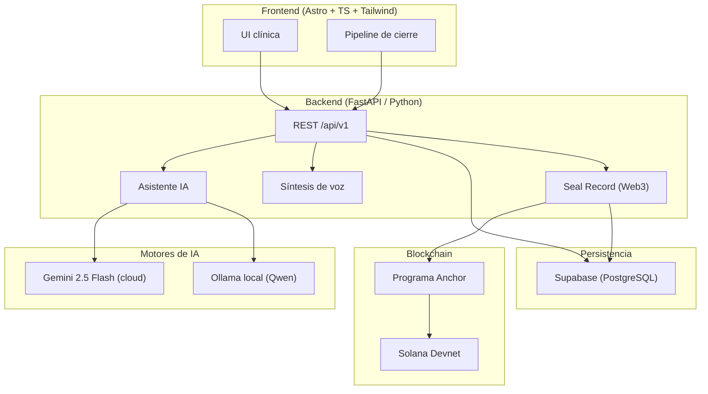
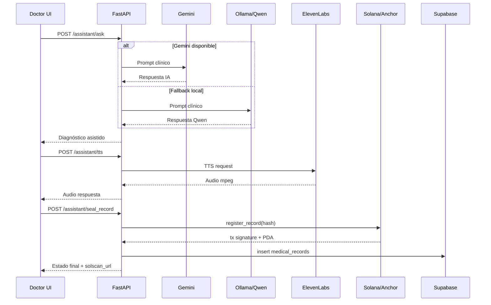

<div align="center">
  
  <h1>OpenS · CRM Médico Inteligente (AI + Voice + Web3)</h1>
  <p><em>Proyecto oficial para Solana Colosseum · evolución de la participación en Hackathon 3 Devpack.</em></p>

  [](https://astro.build/)
  [](https://www.typescriptlang.org/)
  [](https://python.org/)
  [](https://fastapi.tiangolo.com/)
  [](https://supabase.com/)
  [](https://www.postgresql.org/)
  [](https://solana.com/)
  [](https://www.anchor-lang.com/)
  [](https://ollama.com/)
  [](https://ai.google.dev/)
  [](https://elevenlabs.io/)
  [](https://www.docker.com/)
</div>

---

## 📌 ¿Qué es OpenS?

**OpenS** es un CRM médico asistido por IA para atención primaria, diseñado para operar en contextos reales con conectividad variable:

1. **IA clínica híbrida** (Gemini en nube + Qwen local vía Ollama como fallback).
2. **Síntesis de voz** (ElevenLabs con fallback local).
3. **Persistencia clínica** en Supabase/PostgreSQL.
4. **Inmutabilidad Web3** al sellar diagnósticos en **Solana Devnet** mediante un programa Anchor.

---

## 🖼️ Multimedia de la demo

| Home | Asistente | Admin |
| --- | --- | --- |
|  |  |  |

<div align="center">
  
</div>

---

## 🏗️ Arquitectura técnica (detallada)



### Flujo clínico end-to-end



---

## 🧰 Infraestructura y componentes

| Capa | Componente | Rol |
| --- | --- | --- |
| Frontend | Astro + TypeScript | Interfaz médica, dashboard y orquestación UX del pipeline. |
| Backend | FastAPI | API principal, integración con IA, TTS, Supabase y Solana. |
| IA Cloud | Gemini 2.5 Flash | Motor principal para respuestas clínicas. |
| IA Local | Ollama + Qwen2.5 | Fallback offline/edge cuando falla la nube. |
| Voz | ElevenLabs | Síntesis de voz de alta naturalidad. |
| Base de datos | Supabase PostgreSQL | Pacientes, historial médico y metadata de sellado. |
| Blockchain | Solana Devnet + Anchor | Registro inmutable de hash clínico y trazabilidad. |
| Observabilidad local | scripts de testing | Verificación de integraciones y smoke tests de API. |

---

## ⚙️ Requisitos

1. **Python 3.11+**
2. **Node.js 22+**
3. **Git**
4. **Ollama** (si usarás fallback local Qwen)
5. **Solana CLI + wallet devnet** (para sellado real)
6. Credenciales:
   - Supabase (`SUPABASE_URL`, `SUPABASE_KEY`)
   - Gemini (`GOOGLE_API_KEY` o `GEMINI_API_KEY`)
   - ElevenLabs (`ELEVENLABS_API_KEY`)
   - Solana (`SOLANA_PROGRAM_ID`, wallet local o `SOLANA_KEYPAIR_JSON`)

---

## 🚀 Ejecución local paso a paso

### 1) Clonar repositorio

```bash
git clone https://github.com/CarlosWilliamsR/OpenS-Project.git
cd OpenS-Project
```

### 2) Backend

```bash
cd backend
python3 -m venv .venv
source .venv/bin/activate
pip install -r requirements.txt
cp .env.example .env
```

Configura `backend/.env`:

```env
GOOGLE_API_KEY=
GEMINI_MODEL=gemini-2.5-flash
OLLAMA_BASE_URL=http://localhost:11434
OLLAMA_MODELS=qwen2.5:7b
SUPABASE_URL=
SUPABASE_KEY=
ELEVENLABS_API_KEY=
ELEVENLABS_VOICE_ID=21m00Tcm4TlvDq8ikWAM
SOLANA_PROGRAM_ID=8AcadEGS6Vmcj7kcQ8WroPoWioNkBhXFjkH8Db5hSVUX
```

Ejecutar backend:

```bash
python main.py
```

Backend: `http://localhost:8000`

### 3) Ollama + Qwen (fallback local)

```bash
ollama pull qwen2.5:7b
ollama list
```

### 4) Frontend

```bash
cd frontend
npm install
npm run dev
```

Frontend: `http://localhost:3000`

Si desplegas backend en otro host, define:

```env
PUBLIC_BACKEND_URL=https://tu-backend.com/api/v1
```

---

## ✅ Tests de verificación (Supabase, ElevenLabs, Gemini, Qwen, Solana)

### A. Verificar integraciones externas

```bash
cd backend
source .venv/bin/activate
python test_integrations.py --strict
```

Valida:
1. Supabase
2. Gemini
3. Ollama/Qwen
4. ElevenLabs
5. Solana Devnet

### B. Verificar API end-to-end del backend

Con backend ya corriendo:

```bash
cd backend
source .venv/bin/activate
python test_backend.py --base-url http://localhost:8000 --strict
```

Valida endpoints:
- `/`
- `/api/v1/patients`
- `/api/v1/patients/{id}/records`
- `/api/v1/assistant/ask`
- `/api/v1/assistant/tts`
- `/api/v1/assistant/seal_record`

---

## 🧭 Paso a paso para desplegar (hackathon-ready)

### 1) Supabase

1. Crea proyecto Supabase.
2. Crea tablas `patients` y `medical_records`.
3. Usa `SUPABASE_URL` + `SUPABASE_KEY` en backend.
4. Si tu proyecto usa el nuevo comportamiento de Data API (2026), asegura grants explícitos:

```sql
grant select, insert, update, delete on public.patients to service_role;
grant select, insert, update, delete on public.medical_records to service_role;
alter table public.patients enable row level security;
alter table public.medical_records enable row level security;
```

### 2) Smart contract (Solana/Anchor)

1. Confirma `program_id` del contrato (`anchor_program/Anchor.toml` y `lib.rs`).
2. Mantén wallet de devnet con balance:

```bash
solana airdrop 2
```

3. Exporta `SOLANA_PROGRAM_ID` en backend.

### 3) Backend (Render/HF/DO)

1. Root: `backend/`
2. Build: `pip install -r requirements.txt`
3. Start: `uvicorn main:app --host 0.0.0.0 --port $PORT`
4. Variables: todas las de `backend/.env`

### 4) Frontend (Vercel/Cloudflare)

1. Root: `frontend/`
2. Build command: `npm run build`
3. Variables: `PUBLIC_BACKEND_URL` apuntando al backend de producción.

---

## ⚠️ ¿Qué pasa si la demo no corre correctamente?

| Síntoma | Causa probable | Acción recomendada |
| --- | --- | --- |
| `Supabase permission denied` | Falta de grants o credenciales incorrectas | Revisa `SUPABASE_URL/SUPABASE_KEY`, grants explícitos y RLS. |
| Gemini no responde | API key inválida o agotada | Verifica `GOOGLE_API_KEY`; usa fallback Qwen con Ollama. |
| Qwen no responde | Ollama detenido o modelo ausente | `ollama list`, luego `ollama pull qwen2.5:7b`. |
| TTS falla | `ELEVENLABS_API_KEY` inválida/sin créditos | Revisa key y voice id; el backend tiene fallback de voz local. |
| Error en sellado Solana | Wallet sin saldo, RPC caído o program_id incorrecto | `solana airdrop 2`, revisa `SOLANA_PROGRAM_ID`, repite test backend. |
| Frontend no conecta al backend | URL de API incorrecta | Ajusta `PUBLIC_BACKEND_URL` o usa `http://localhost:8000/api/v1`. |

---

## 🔐 Seguridad y buenas prácticas

1. Nunca publiques `SUPABASE_KEY` de tipo `service_role` en frontend.
2. Mantén secretos solo en variables de entorno.
3. Usa RLS + políticas explícitas para acceso por rol.
4. No almacenes PHI sensible en logs.
5. Mantén rotación periódica de keys API.

---

## 👥 Equipo y créditos

- 💻 **Carlos Williams** — **Fundador y Desarrollador Principal**.
- 🎨 **Aysha Tovar** — UX/UI Design.
- 🤝 **Santiago Valecillos** — Colaborador (ediciones previas, no en esta edición).
- 🤝 **Gabriela Carpio** — Colaboradora (ediciones previas, no en esta edición).

Proyecto preparado para **Solana Colosseum Hackathon** y con continuidad desde **Hackathon 3 Devpack**.
